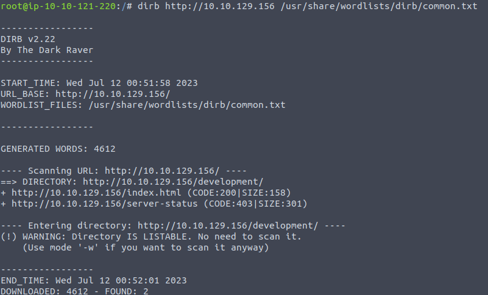
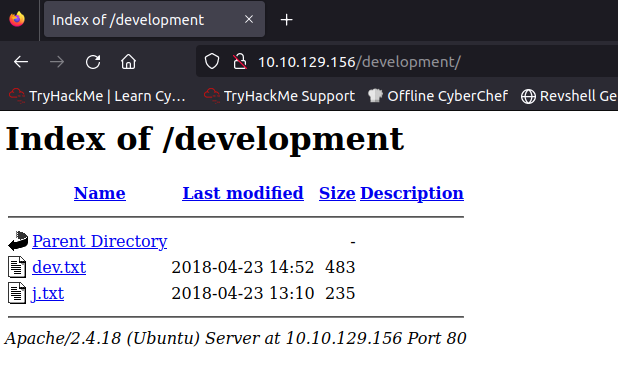
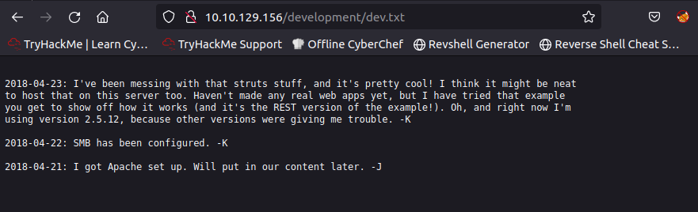
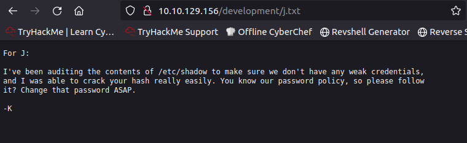
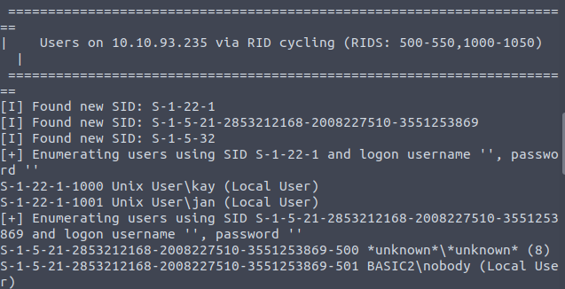
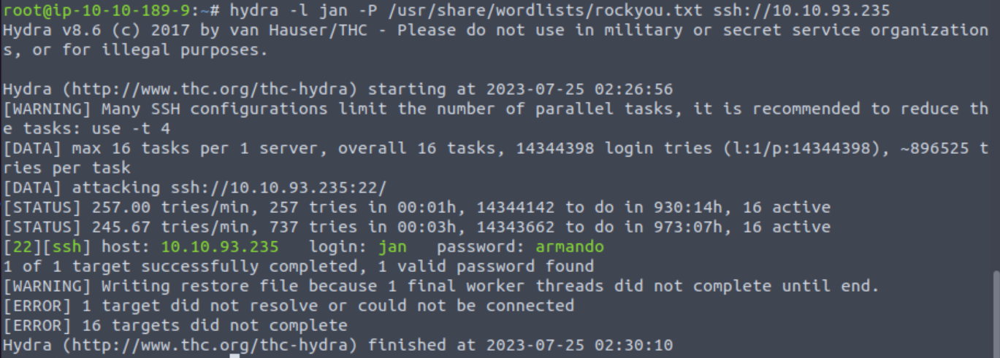
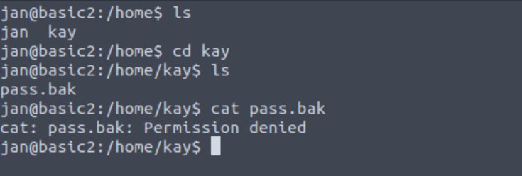
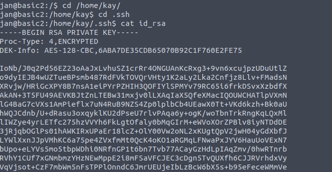
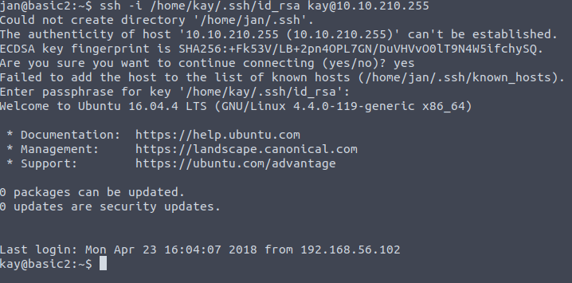
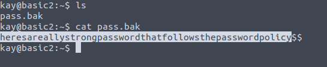

##   TryHackMe  Basic Pentesting

#### 📜 Basic Pentesting

"Basic Pentesting" is a beginner level pentesting room in TryHackMe.

Let's dive in the room.


#### 📜 Task 1. Find the services exposed by the machine 

I used **Nmap** tool to find the services running on the target system

```python
Nmap -sC -sV [Target_Machine_IP]
```


​                                                           Screenshot 1 (nmap results)

We can see the services are : 

- SSH (Port 22)
- **HTTP (Port 80)**
- **SAMBA (Port 139 & 445)**
- HTTP-Proxy (Port 8080)

​	

#### 📜 Task 2. What is the name of the hidden directory on the web server(enter name without /)? 

I used **dirb** tool to find hidden directories on the web server.

```python
dirb http://[Tartget_IP] /usr/share/wordlists/dirb/common.txt
```



​                                                           Screenshot 2 (dirb results)

We can see the hidden directory :  **/development**

Now navigate around the website and development directory on the website.



​                                                             Screenshot 3 ("/development" directory)


Now let’s open each texts. We may find something interesting here



​                                                                          Screenshot 4 (dev.txt)




​                                                                           Screenshot 5 (j.txt)


#### 📜 Task 3. **User brute-forcing to find the username & password**

Here we need to find the username and password. But first we need to determine the users present on our target system.

So we know that samba is running on our target (from Nmap results & text files on the websites)
We can use **enum4linux** tool to enumerate the machine. Syntax for tool is as follows :

```python
enum4linux -e [Target_Machine_IP]
```




​                                                              Screenshot 6 (enum4linux results)

Now we can find the users **"kay"** and **"jan"**

From the texts in development folder we analysed that J (or Jan) is having a weak password so it will be easier to brute-force that using our best friend **Hydra.**

So the syntax for hydra for cracking Jan’s password will be :

```python
hydra -l jan -P
/usr/share/wordlists/rockyou.txt ssh://[TARGET_MACHINE_IP]
```



​                                                              Screenshot 7 (hydra results)


#### 📜 Task 4. What is the username?

*Answer* : **jan** (from Screenshot 7)


#### 📜 Task 5. What is the password?

*Answer* : **armando** (from Screenshot 7)


#### 📜 Task 6. **What service do you use to access the server(answer in abbreviation in all caps)?** 

*Answer* : **ssh** 

```
ssh jan@[TARGET_MACHINE_IP]
```


#### 📜 Task 7. Enumerate the machine to find any vectors for privilege escalation. 

We can login with "jan" but  we don't have permission pass.bak file



​                                                              Screenshot 8 (Permission denided)


So we should escalate privilege to get loot level but we don't have the password for user kay. 

However, we can use ssh key of kay and then finding the passphrase to access the machine as kay.


**First,** Get the id_rsa key from kay’s directory and save it in our system.

```python
cd /home/kay
cd .ssh
cat id_rsa
```



​                                                              Screenshot 9 (id_rsa)

Copy this key and save it in our system by name "id_rsa.txt"


**Second,** Cracking the key for passphrase with **"John The Ripper"**

```
python3 /opt/john/ssh2john.py id_rsa.txt > decrypted.txt
```

This will convert our Private SSH key into john form so that it can be cracked further

```
john --wordlist=/usr/share/wordlists/rockyou.txt decrypted.txt
```

This will give us our phrase : **beeswax**


**Third,** Accessing as kay

Go to jan’s shell and write this command (because if we try to do this outside the ssh of jan or on our system shell it will not allow that)

```
ssh -i /home/kay/.ssh/id_rsa kay@[TARGET_MACHINE_IP]
```



​                                                              Screenshot 10 (Login with kay)

And finally we can see **"pass.bak"** file



​                                                              Screenshot 11 (pass.bak)
